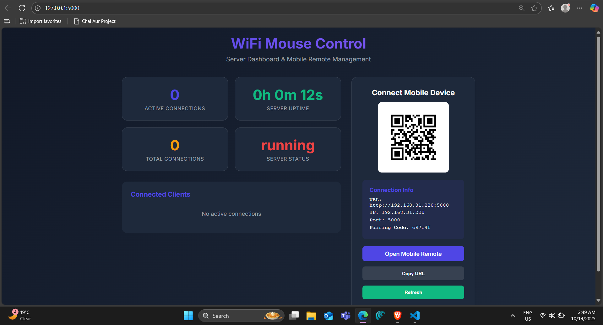
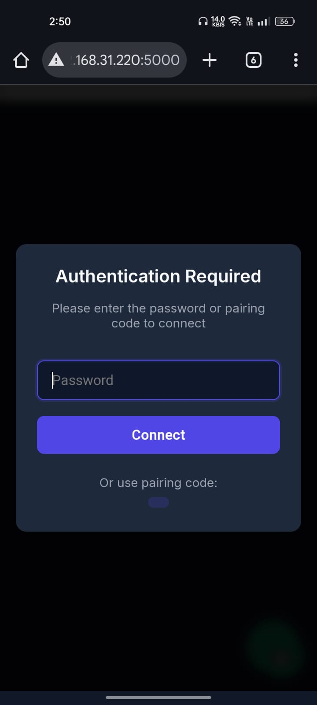
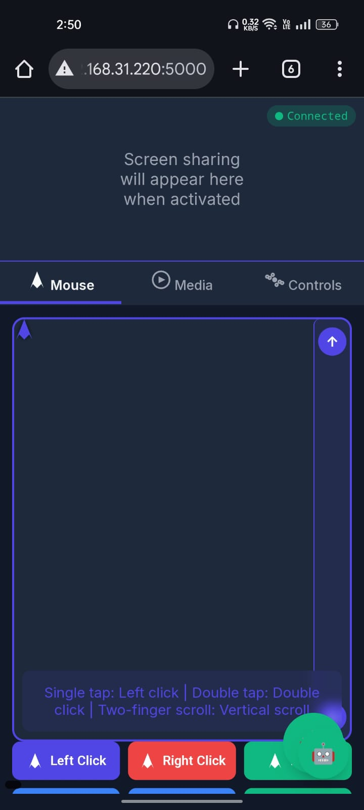
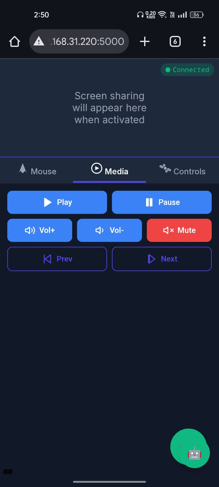
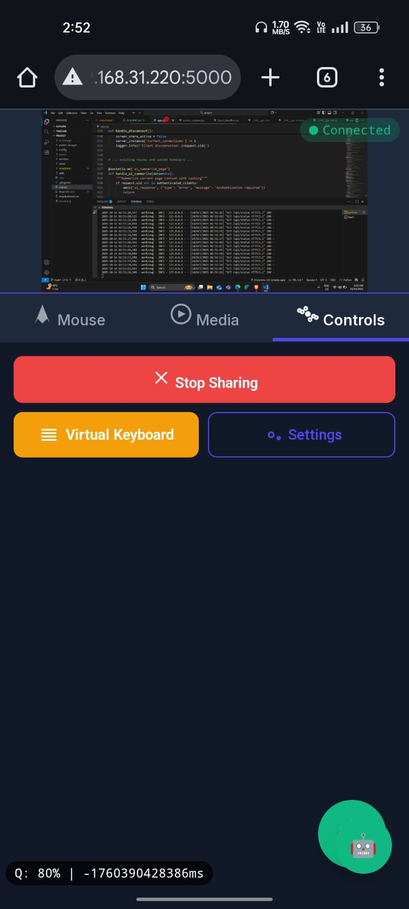
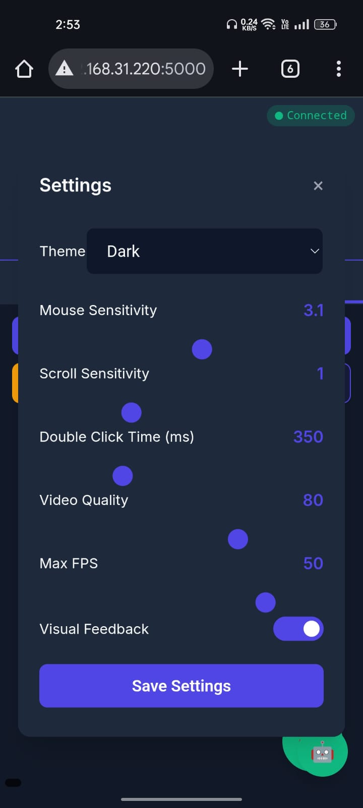
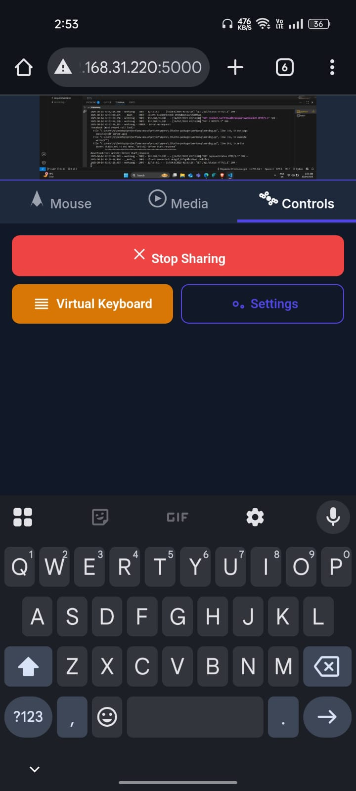

# CursorFlow

CursorFlow is a web-based application that combines the functionalities of two innovative mouse control systems: **Dristi Mouse** and **MobiMouse**. It provides accessibility solutions for hands-free and remote mouse control, making it ideal for individuals with mobility challenges or those who want to control their computer remotely.

---

# AI_MobilePointer
**GitHub Repository:** https://github.com/iamdivyanshukumar/AI_MobilePointer.git

A powerful remote control application that transforms your mobile device into a wireless mouse, keyboard, and AI-powered assistant for your computer. Control your desktop remotely with screen sharing capabilities and get AI-powered insights about your screen content.

---

## Features

### Remote Control
- Touchpad Mouse Control: Precise cursor control with customizable sensitivity
- Virtual Keyboard: Full keyboard input support
- Media Controls: Play, pause, and control media volume
- Screen Sharing: Real-time screen mirroring to your mobile device
- Multi-touch Gestures: Single/double tap, two-finger scroll support

### AI Assistant
- Screen Content Analysis: OCR-powered text extraction from screen
- Smart Summarization: AI-generated summaries of visible content
- Q&A System: Ask questions about on-screen content
- Context Awareness: Remembers conversation history and content
- Vector Database: Efficient content storage and retrieval

### Security & Connectivity
- Password Protection: Secure authentication system
- QR Code Pairing: Easy mobile connection setup
- Cross-platform: Works on Windows, macOS, and Linux
- Real-time Communication: WebSocket-based low-latency control

---

## Components Overview

### Flask Web Server (app.py)
- Handles HTTP requests and WebSocket connections
- Manages authentication and client sessions
- Coordinates between mobile clients and desktop controls

### AI Service (services/ai_service.py)
- OpenAI integration for text processing
- Vector database for content storage
- Conversation management and context retention

### Text Extraction (services/text_extractor.py)
- Screen capture using MSS
- OCR processing with Tesseract
- Image preprocessing for better text recognition

### Web Interface (templates/)
- Responsive mobile interface (index.html)
- Desktop dashboard (desktop.html)
- Real-time screen sharing display

---

## Quick Start

### Prerequisites
- Python 3.8+
- Tesseract OCR
- OpenAI API Key (for AI features)

### Installation

**Clone the repository**
```bash
git clone https://github.com/yourusername/wifi-mouse-control.git
cd wifi-mouse-control
```

**Install Python dependencies**
```bash
pip install -r requirements.txt
```

**Install Tesseract OCR**
- Windows: Download from UB-Mannheim/tesseract
- macOS: brew install tesseract
- Linux: sudo apt-get install tesseract-ocr

**Configure Environment**
```bash
cp .env.example .env
echo "OPENAI_API_KEY=your_openai_api_key_here" >> .env
```

### Running the Application
**Start the server**
```bash
python app.py
```

**Access the application**
- Desktop: http://[server-ip]:5000
- Mobile: automatically redirects to the remote interface

**Connect your mobile device**
- Scan the QR code from the desktop dashboard, or
- Enter the server URL manually on your mobile browser

---

## Interface Overview

### Desktop Dashboard
<p align="center">
  
</p>

### Mobile Remote Interface
<p align="center">
  
  
  
</p>
<p align="center">
  
  
  
  
</p>


---

## Configuration

### Environment Variables
Create a .env file in the project root:
```
OPENAI_API_KEY=your_openai_api_key_here
SECRET_KEY=your_secret_key_optional
```

### Server Configuration
Modify config/settings.py for advanced settings:
```
MOUSE_SENSITIVITY = 2.2
SCROLL_SENSITIVITY = 1.0
VIDEO_QUALITY = 80
MAX_FPS = 30
AUTH_PASSWORD = 'admin123'
```

---

## API Endpoints

### HTTP Endpoints
GET / - Main application (auto-detects device type)
GET /mobile - Direct mobile interface access
GET /api/status - Server status information
GET /api/ai/status - AI service status

### WebSocket Events
move_mouse - Mouse movement control
click - Mouse click events
scroll - Scroll wheel control
keyboard_input - Text input
media_key - Media control commands
ai_summarize_page - AI content summarization
ai_ask_question - AI Q&A about screen content

---

## AI Assistant Usage

The AI assistant uses OCR to extract text from your screen and provides:
- Content Summarization
- Question Answering
- Content Analysis
- Caching & Performance

---

## Troubleshooting

Tesseract not found
Solution: Install Tesseract OCR and ensure it's in PATH

Screen sharing not working
Solution: Run as administrator or enable screen recording permission

AI features disabled
Solution: Add API key to .env file

Connection refused
Solution: Allow port 5000 through firewall and check server IP

---

## Performance Notes

- Latency: <100ms for mouse movements
- Screen Sharing: Adjustable quality for bandwidth optimization
- AI Processing: First OCR takes ~3s, cached for faster reuse
- Memory Usage: ~100MB base + 50MB per active session

---


## Contributing

1. Fork the repository
2. Create a feature branch
3. Commit changes
4. Push to branch
5. Open a Pull Request

---

## Acknowledgments

- OpenAI – for AI capabilities
- Tesseract OCR – for text extraction
- Flask and SocketIO – for the web framework
- FAISS – for vector similarity search


## Dristi Mouse:-

Dristi Mouse is an innovative hands-free mouse control system that uses eye and head gestures to control the cursor. It is designed to provide accessibility solutions for individuals with mobility challenges or anyone looking for a hands-free way to interact with their computer.

Features
- Eye-Controlled Mouse Movement: Move the cursor using eye and head gestures.
Blink Detection for Clicks: Double blink to simulate a mouse click.

- Head Movement for Navigation: Control the cursor by moving your head.

- Mouth Open-Close Toggle: Pause or resume cursor control with mouth gestures.

- Customizable Sensitivity: Adjust thresholds for eye and head movements to suit your needs.

Prerequisites:-

- Python 3.8 or higher
- pip (Python package manager)
- A webcam for eye and head tracking
- Mediapipe and OpenCV libraries for facial landmark detection and image processing

Installation Process

1. For running cursorflow(Dristi mouse)
   ```bash
   cd..

3. Run the Application Start the application:
python [app.py](http://vscodecontentref/3)

4. Access the Application

Open your browser and navigate to http://localhost:5000.

4. Use the Dristi Mouse

- Go to the CursorFlow website.
- At the top, you will see a Buy option under which the Dristi Mouse is listed.
- Click on it, and you will be redirected to another page.
- On this page, you will see two options: Start Tracking and Stop Tracking.
- Click on Start Tracking to activate the Dristi Mouse and enjoy hands-free control.

Usage
- Eye-Controlled Cursor Movement: The application uses Mediapipe's face mesh to track eye and head movements. Move your head or eyes to control the cursor's position on the screen.

- Blink Detection for Clicks: Double blink to simulate a left mouse click. Long blink (hold for 0.5 seconds) to simulate a right mouse click.

- Mouth Open-Close Toggle: Open your mouth to pause cursor movement. Close your mouth to resume cursor movement.

- Head Movement for Navigation: Move your head left, right, up, or down to navigate the screen.

File Structure:-

<pre><code>Cursorflow/ ├── app.py # Main application file ├── requirements.txt # Dependencies for the project ├── mobimouse/ │ ├── app.py # Submodule for MobiMouse │ ├── requirements.txt # Dependencies for MobiMouse │ └── templates/ │ └── index.html # HTML template for MobiMouse ├── templates/ │ ├── index.html # Homepage template │ ├── mobi-mouse.html # MobiMouse page template │ ├── vanni.html # Vanni page template │ └── dristi.html # Dristi page template ├── static/ │ ├── css/ # CSS files for styling │ ├── images/ # Images used in the application │ └── js/ # JavaScript files └── README.md # Documentation file </code></pre>

Technologies Used
- Flask: Web framework for the backend.
- Flask-SocketIO: Real-time communication between the server and client.
- Mediapipe: Facial landmark detection for Dristi.
- OpenCV: Image processing for Dristi.
- PyAutoGUI: Simulate mouse movements, clicks, and scrolling.
- Pynput: Low-level control of the mouse for MobiMouse.
- MSS: Screen capturing for MobiMouse's screen sharing.

Important Notes
- Same Wi-Fi Network: Ensure that both your computer and mobile device are connected to the same Wi-Fi network for MobiMouse to work.

- Webcam Requirement: A webcam is required for Dristi's eye and head tracking features.

- Lighting Conditions: Ensure proper lighting for accurate facial landmark detection.

License
This project is licensed under the MIT License.

Contact
For any queries or support, contact us at
 - Email: divyanshussa@gmail.com
 - Phone Number- 6397766117
